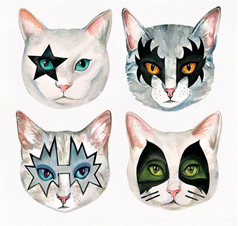
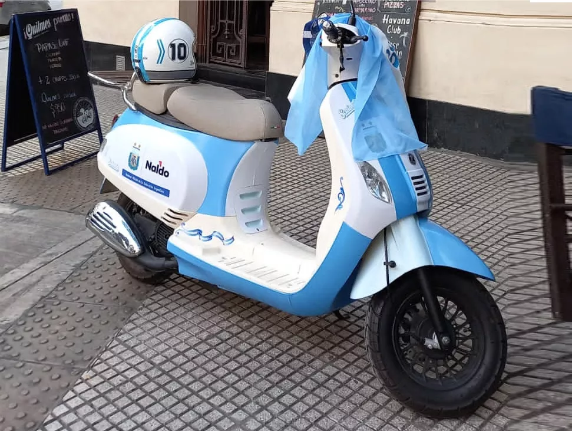

# KISS

# Equipo: la operatineta

`Subite pibe, vamos a aprobar!`

## Integrantes

|Apellido|Nombre|Legajo|Curso|
|:---|:---|:---|:---|
|Alvarez|Luis|122.216-8|K3013|
|Di Paulo|María Belén|124.088-2|K3013|
|Ipar|Joaquin|168.859-5|K3013|
|Famulari|Sebastián|129.135-0|K3054|
|Asquini|Alejandro|150.144-6|K3013|

## :paperclip: Links Útiles

- [Enunciado](https://docs.google.com/document/d/17WP76Vsi6ZrYlpYT8xOPXzLf42rQgtyKsOdVkyL5Jj0)
- [Documento de Pruebas](https://docs.google.com/document/d/1SBBTCweMCiBg6TPTt7zxdinRh4ealRasbu0bVlkty5o)
- [Repo de Pruebas](https://github.com/sisoputnfrba/kiss-pruebas)
- [Página de SO](https://www.utnso.com.ar/)
- [Sistema de Inscripciones](https://inscripciones.utnso.com.ar/)
- [Foro de Consultas](https://github.com/sisoputnfrba/foro)
- [Commons](https://github.com/sisoputnfrba/so-commons-library/tree/master/src/commons)